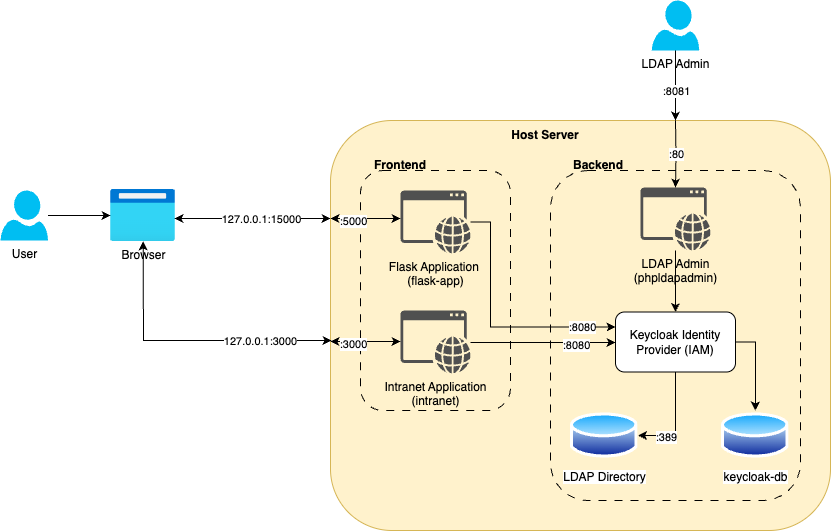

# SEAS-8405—Homework 8—Summary Report

This report reviews the Flask application secured by IAM and what steps were taken to identify vulnerabilities within the 
image, application, and system. Furthermore, the report will include a security analysis with threat modeling using STRIDE 
and recommends mitigation strategies for the vulnerabilities found. In addition, it will present the improved architecture 
with an explanation of the OAuth 2.0 and OIDC flows used. Finally, the report will reflect on the process and lessons learned
referencing the Okta case study and its impact on the design.

## 1. Steps Taken

Identifying the vulnerabilities, performing threat modeling, and remediating those vulnerabilities follows a systemic approach.
The initial code analysis was performed using Canvas Bandit, a code security tool used for identifying vulnerabilities in Python codebases.
Canvas Bandit works by scanning the codebase for common security vulnerabilities and antipatterns. Docker or image analysis was done using
Docker Scout is a software supply chain security tool that helps to understand and improve the security posture of container images. 
Scout scans the container images for known vulnerabilities or CVEs. Finally, system scanning was performed using Docker Bench for Security, 
a tool automatically auditing Docker installations against industry standards looking for commonly known security misconfigurations.

STRIDE, a threat modeling framework, aided the identification of vulnerabilities across STRIDE's treat categories of Spoofing, Tampering, 
Repudiation, Information Disclosure, Denial of Service, and Elevation of Privilege.

#### STRIDE Analysis

| STRIDE Category | Threat (Focus: Authentication, Authorization, Token Management)                                                                                                                                                                                                                                 | Impact                                          | Mitigation Strategies (Including Token Best Practices & Secret Storage)                                                                                                                                                                                                                                                                  |
|--|-------------------------------------------------------------------------------------------------------------------------------------------------------------------------------------------------------------------------------------------------------------------------------------------------|-------------------------------------------------|------------------------------------------------------------------------------------------------------------------------------------------------------------------------------------------------------------------------------------------------------------------------------------------------------------------------------------------|
| S - Spoofing | 1\. Phishing/Social Engineering: Attackers trick users into revealing credentials. 2\. Credential Theft: Compromised accounts due to Data Breaches.                                                                                                                                         | Loss of Authenticity through unauthorized access| - Customer and employee education on how to prevent phishing attacks.  - Implementing multi-factor authentication or MFA. - Secure storage of secrets: Use Docker Secrets for sensitive credentials in production; avoid hardcoding.                                                                                             |
|  | 3\. Replay Attacks: Interception and replaying of valid authentication requests/tokens. 4\. Stolen Tokens: An attacker obtains a valid session or access token.                                                                                                                             | Loss of Authenticity through unauthorized access | - Token Expiration: Access tokens should have an expiration.   - Token Rotation: Single-use tokens.   - Invalidate Token: Invalidating tokens on logout. - Token Revocation: Implement user token revocation.                                                                                                                |
|  | 5\. Forged Tokens: An attacker crafts a fake token by compromising the token signing key.                                                                                                                                                                                                       | Loss of Authenticity through unauthorized access | - Asymmetric cryptographic signing for tokens.   - Secure Key Management: Securely store token signing keys.  - Utilize Hardware Security Modules (HSMs) or Key Management Services (KMS).                                                                                                                                       |
| T - Tampering | 1\. Credential Tampering: Modification of user credentials in transit or at rest. 2\. Token Modification: Altering claims within a token. 3\. Token Expiration Tampering: Modifying a token's expiration timestamp.                                                                     | Loss of Authenticity through unauthorized access and Impersonation | - Implement TLS/HTTPS for all traffic.   - Implement strict access control to identity stores (Keycloak DB, LDAP).  - Validate all token claims, server-side.                                                                                                                                                                    |
| R - Repudiation | 1\. Insufficient Logging of Authentication Events: Lack of detailed logs for login attempts. 2\. Lack of Audit Trails for Policy Changes: Changes to authorization policies are not logged. 4\. Lack of Token Issuance/Invalidation Logs: Events related to token lifecycle not logged. | Undetected cyber event or Delayed Incident Response | - Log all authentication and authorization events such as logins, MFA challenges, credential changes, account lockouts, authorization policy evaluations, and resource access outcomes.  - Version control policies.   - Log every modification to IAM policies, roles. - Log all token events, including token revocations. |
| I - Information Disclosure | 1\. Sensitive Credential Exposure: Passwords or secrets stored insecurely.                                                                                                                                                                                                                      | Loss of confidentiality via Data Breach                                     | - Secure storage of secrets: Avoid hardcoding credentials, use a dedicated secret manager.                                                                                                                                                                                                                                               |
|  | 2\. User Enumeration: Login pages reveal whether a username exists. 3\. Information Leakage in Authorization Responses: Error messages or API responses reveal too much internal detail.                                                                                                    | Loss of confidentiality via Data Breach                                     | - Use generic error messages to avoid exposing internal system details or policy logic in API responses.   - Implement rate limiting on failed login attempts.                                                                                                                                                                       |
|  | 4\. Directory Service Exposure: LDAP or database services exposed to unauthorized users.                                                                                                                                                                                                        | Loss of confidentiality via Data Breach                                     | - Network Segmentation: Keep keycloak-db and ldap services on the backend network; do not expose externally.   - phpLDAPadmin: Restrict access to phpLDAPadmin via firewall.                                                                                                                                                         |
|  | 5\. Insecure Token Storage: Tokens stored in vulnerable locations. 6\. Publicly Accessible Token Keys: Signing or encryption keys exposed.                                                                                                                                                  | Loss of confidentiality via Data Breach                                     | - Store session tokens in HttpOnly and Secure cookies.  - Secure Key Management: Ensure Keycloak's private signing keys are stored securely (e.g., HSM/KMS) and are not publicly accessible.   - Rotate keys regularly.                                                                                                          |
| D - Denial of Service (DoS) | 1\. Brute-Force/Credential Stuffing Attacks: Overwhelming authentication services.                                                                                                                                                                                                              | Resource Exhaustion                             | - Rate limiting on all endpoints (login, registration, password reset).   - CAPTCHA implementation.   - Account lockout policies.   - Utilize WAF/CDN for DDoS protection.                                                                                                                                                   |
|  | 3\. MFA Flooding: Attackers repeatedly triggering MFA challenges. 4\. Database Overload: Excessive queries or resource exhaustion on Keycloak/LDAP databases. 5\. Excessive Policy Evaluation Load: Complex or inefficient authorization policies.                                      | Resource Exhaustion                             | - Implement grace periods between MFA attempts.   - Monitor for suspicious MFA request volumes. - Docker Compose Resource Limits: Define CPU and memory limits for keycloak-db and ldap containers in docker-compose.yml.                                                                                                        |
| E - Elevation of Privilege | 1\. Role Misconfiguration: Users assigned roles with more permissions than necessary.                                                                                                                                                                                                           | Loss of Authenticity through unauthorized access and Account Takeover | - Regular audit of user roles and groups.   - Enforce separation of duties.                                                                                                                                                                                                                                                          |
|  | 2\. Token Manipulation: Successfully altering token to gain greater permissions. 9\. Insufficient Token Validation: Failure to properly validate token signature, expiration, or claims. 10\. Bypass of Token Revocation: Using a token that should have been revoked.                                                                                                                                                                                             | Loss of Authenticity through unauthorized access and Account Takeover | - Validate token claims against expected values and scopes.  - Ensure claims are cryptographically signed.                                                                                                                                                                                                                           |

#### MITRE ATT&CK
MITRE ATT&CK is a knowledge base of adversary tactics and techniques based on real-world observations (TTP). 
It describes actions a malicious user might perform during a cyberattack. Mapping the above vulnerabilities to 
 TTPs provides specific control measures to implement to help mitigate vulnerabilities.

#### MITRE ATT&CK Mapping

| Tactic  | Techniques (Examples)  | Relevance                                                                                                                                                                                                            |
|---|---|----------------------------------------------------------------------------------------------------------------------------------------------------------------------------------------------------------------------|
| Initial Access  | T1566 (Phishing), T1190 (Exploit Public-Facing Application) | Exploiting vulnerabilities in initial authentication mechanisms.                                                                                                                                                     |
| Credential Access | T1552 (Unsecured Credentials), T1555 (Credentials from Password Stores) | Stealing credentials (passwords, hashes) and tokens (session, access, refresh tokens) used for authentication and authorization.                                                                                     |
| Privilege Escalation  | T1068 (Exploitation for Privilege Escalation  | Gaining higher-level permissions or authorizations by exploiting vulnerabilities in authorization logic, misconfigured roles.                                                                                        |
| Discovery  | T1598 (Phishing for Information), T1087 (Account Discovery), T1069 (Permission Groups Discovery)| Gaining knowledge about the system and network. |

#### Controls Mapping
Using control mappings, we further link the identified vulnerabilities to specific security controls described by 
frameworks such as the NIST Special Publication 800-53, CIS Docker Benchmark, and OWASP Top 10.

| Issue                | Control                  | Framework Reference      |
|----------------------|--------------------------|--------------------------|
| Hardcoded secrets    | Use environment variables| NIST 800-53: SC-12, SC-28 |
| Root user            | Non-root user            | NIST 800-53: AC-6, CM-6  |
| Network exposure     | Restrict with networks   | NIST 800-53: SC-7        |
| Missing health check | Add `HEALTHCHECK`        | CIS Docker Benchmark     |
| Phishing/Social Engineering   | User education, Strong MFA, Suspicious login detection.        | NIST 800-53: AT-2|        |
|Lack of Token Issuance/Invalidation Logs|Log all token issuance, revocation, session termination.| NIST 800-53: AU-2|
Based on the above code, docker, system analysis, and threat modeling, specific vulnerabilities were identified and validated by reproducing the 
vulnerabilities with tests. Reproducing the vulnerability is a critical step in validating that the vulnerability is remediated
after the necessary controls are put in place.

Once the tests were documented, remediation for each vulnerability was proposed, recorded, and implemented. The code analysis
using Canvas Bandit identified command injection, remote code execution, hardcoded passwords, and insecure default configurations
in the app.py python file, representing the application. In addition, Docker deployment vulnerabilities identified by the analysis were 
remediated by updating the docker-compose.yml, included restricting network port binding to localhost, setting resource limits, making the 
container filesystem read-only, removing unnecessary features, and preventing privilege escalation.

## 2. Vulnerabilities Found and Fixed
Several significant vulnerabilities were identified in the application and deployment.

1. **Hardcoded Password**: The password was coded directly in app.py python file representing the application. Storing sensitive information
such as credentials is not a good practice as the file is committed to a code repository and visible to everyone with
access to the codebase. This vulnerability was fixed by moving the credentials into a .env file and retrieved using os.environ.get
that is not committed to the codebase.

4. **Wide Network Binding**: The application was bound to 0.0.0.0, allowing for access from the entire internal network or even external networks if firewalls 
are not properly configured. This issue was remediated by changed the binding in docker-compose.yml's command and ports mapping to 127.0.0.1, 
restricting access to the only host machine.

5. **Excessive Container Privileges**: The Docker container ran with default, Linux capabilities. Remediating this vulnerability included
adding the _cap_drop: - ALL_ and _security_opt: - no-new-privileges_ configurations to the docker-compose.yml file.

6. **Writable Container Filesystem**: The Docker file system was not protected allowing modifications of the container's filesystem. This
issue was remediated by configuring the _read_only: true_ property in the docker-compose.yml file.

7. **Denial of Service or DoS**: The docker containers lacked limits allowing memory and processes to grow beyond system resources, making
it vulnerable to Denial of Service or DoS attacks. This vulnerability was remediated by configuring _mem_limit_ and _pids_limit_ in the 
docker-compose.yml file.

## 3. OAuth 2.0 and IODC flows supported by the architecture and how it improves security

The architecture above leverages Keycloak as an Identity Provider or IdP, protecting the Flask and intranet application. Keycloak
is an open-source IdP solution implementing both Oauth 2.0 and OpenID Connect or OIDC frameworks. As an authorization framework, 
OAuth 2.0 enables "delegated authorization" without having to share security credentials. The most basic OAuth 2.0 flow is the authorization flow.
Upon trying to access the application, the user is redirected to a login page for authentication. Once successfully authenticated, the user
is redirected to the application with a single-use authorization code that is used to issue an access token used instead of credentials to access the application
and its resources. OpenID Connect or OIDC wraps OAuth 2.0's authorization flows by adding an "ID Token" facilitating the user authentication.

Furthermore, the improved architecture leverages Docker to create a secure infrastructure using multiple controls. By design, 
Docker uses containerization to isolate the application and its dependencies from the host system. Using a minimal 
container image such as the _python:3.13-alpine_ image significantly reduces the attack surface by introducing only
the required dependencies. The hardening the infrastructure included creating an application user, instead of using the
root-user to run the application and limiting the resources that the container is allowed to use by configuring memory
and process limits, using _mem_limit_ and _pids_limits_. Using limits also helps reduce the potential blast radius of a successful
cyberattack. Docker also supports network isolation, separating our infrastructure to a _frontend_ and _backend_ network, limiting 
traffic between tiers to only the ones expected and necessary. In this architecture the web application sits in the _frontend_ while
the database is contained in the _backend_ tier. The docker container was configured to prevent any tampering to files in the container by
limiting access to the file-system to _read-only_. The default _0.0.0.0_ binding was limited to _127.0.0.1_, preventing
any access to the container from any other IP address apart from the host machine or _localhost_. Finally, all credentials were
securely relocated to a _.env_ file that is not shared or committed to repositories. Leveraging Docker's capabilities with the above configuration
changes along with the secure coding practices described earlier raised the application's security posture significantly.

## 4. Reflection in light of the Okta incident, lessons learned, and impact to design
In light of the 2023 Okta incident, analyzing, identifying, and remediating vulnerabilities recommended by the above tools used provided a valuable learning opportunity for practical 
application and infrastructure hardening. Summarizing the Okta incident, malicious actors accessed Okta's customer support system and retrieved valid session tokens used for successful session hijacking. 
While hindsight is always 20/20, Okta's system implementation had critical security gaps that enabled the attack. 
Okta should have taken greater care to encrypt and store the tokens securely, along with implementing token rotation and expiration, preventing tokens from being reusable and exploitable.

One of the most important Defense in Depth lessons is to have a layered security posture. Applications are
bound to have multiple vulnerabilities that a single control will not remediate. Vulnerabilities exist in code and configurations alike. Default
configurations should be understood, vetted, and modified if necessary, along with limiting the attack surface by using only required components. All
user-provided inputs should be validated, ideally both on the client and server side. Server side validation is NON-NEGOTIABLE.
Implementing a Secure Software Development Life Cycle or SSDLC is paramount in identifying vulnerabilities early and often.
Understand the capabilities of hosting platforms such as Docker, tools (e.g., Scout, Canvas Bandit) used for identifying vulnerabilities and 
using security frameworks (e.g., STRIDE, MITRE ATT&CK) to allow for a holistic review to security and guiding the remediation of those vulnerabilities identified. 
We have seen that outdated Docker images could contain known vulnerabilities, updating this is a critical step in securing the infrastructure.

## 5. Appendix

### 5.1 Specific commands executed during the exercise
1. Run make build
2. Run make scan - Scans for image vulnerabilities
    1. Show report.
3. Run make check - Scans for application vulnerabilities 
4. Run make host-security - Scans for system vulnerabilities 
5. Run make up
6. Goto: curl -H "Authorization: Bearer <access_token>" http://localhost:15000
7. Replace <access_token> with the valid token.
9. Finally, the application is bound to 0.0.0.0; it will listen for connections on all available network interfaces. This means it's accessible not just from the local machine but potentially from other machines on the local network or even the internet if firewalls are not properly configured.