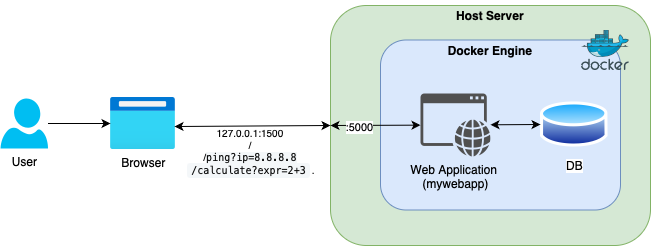

# SEAS-8405—Homework 7—Summary Report

This report reviews the presented web application for what steps were taken to identify vulnerabilities within the 
image, application, and system. Furthermore, the report will discuss the vulnerabilities found and how those 
vulnerabilities were remediated. In addition, it will present the improved architecture and how it improves security.
In conclusion, the report will reflect on the process and lessons learned.

## 1. Steps Taken

Identifying the vulnerabilities, performing threat modeling, and remediating those vulnerabilities follows a systemic approach.
The initial code analysis was performed using Canvas Bandit, a code security tool used for identifying vulnerabilities in Python codebases.
Canvas Bandit works by scanning the codebase for common security vulnerabilities and antipatterns. Docker or image analysis was done using
Docker Scout is a software supply chain security tool that helps to understand and improve the security posture of container images. 
Scout scans the container images for known vulnerabilities or CVEs. Finally, system scanning was performed using Docker Bench for Security, 
a tool automatically auditing Docker installations against industry standards looking for commonly known security misconfigurations.

STRIDE, a threat modeling framework, aided the identification of vulnerabilities across STRIDE's treat categories of Spoofing, Tampering, 
Repudiation, Information Disclosure, Denial of Service, and Elevation of Privilege.

#### STRIDE Analysis

| Threat Category       | Example                        | Impact                  | Mitigation            |
|-----------------------|--------------------------------|-------------------------|-----------------------|
| Spoofing              | No auth on `/calculate`        | Unauthorized access     | Add authentication    |
| Tampering             | Unsafe IP input to `ping`      | Command injection       | Input validation      |
| Repudiation           | No logging                     | Untraceable actions     | Implement logging     |
| Information Disclosure| Hardcoded passwords            | Credential exposure     | Use environment vars  |
| Denial of Service     | Unrestricted `ping` or `eval`  | Resource exhaustion     | Rate limiting         |
| Elevation of Privilege| Runs as root (potential)       | System compromise       | Non-root user         |

#### MITRE ATT&CK
MITRE ATT&CK is a knowledge base of adversary tactics and techniques based on real-world observations (TTP). 
It describes actions an malicious user might perform during a cyberattack. Mapping the above vulnerabilities to 
 TTPs provides specific control measures to implement to help mitigate vulnerabilities.

#### MITRE ATT&CK Mapping

| Tactic                | Technique ID | Technique Name                  | Relevance                  |
|-----------------------|--------------|---------------------------------|----------------------------|
| Initial Access        | T1190        | Exploit Public-Facing App       | Command injection in `/ping` |
| Execution             | T1059        | Command and Scripting Interpreter | Unsafe `eval()`          |
| Persistence           | T1525        | Implant Container Image         | No image validation       |
| Privilege Escalation  | T1611        | Escape to Host                  | Root user risks           |
| Defense Evasion       | T1211        | Exploitation for Defense Evasion | Poor isolation           |

#### Controls Mapping
Using control mappings, we further link the identified vulnerabilities to specific security controls described by 
frameworks such as the NIST Special Publication 800-53, CIS Docker Benchmark, and OWASP Top 10.

| Issue                | Control                  | Framework Reference       |
|----------------------|--------------------------|---------------------------|
| Hardcoded secrets    | Use environment variables| NIST 800-53: SC-12, SC-28 |
| Root user            | Non-root user            | NIST 800-53: AC-6, CM-6   |
| Network exposure     | Restrict with networks   | NIST 800-53: SC-7         |
| Missing health check | Add `HEALTHCHECK`        | CIS Docker Benchmark      |
| Unvalidated inputs   | Strict validation        | OWASP Top 10: A1-Injection|

Based on the above code, docker, system analysis, and threat modeling, specific vulnerabilities were identified and validated by reproducing the 
vulnerabilities with tests. Reproducing the vulnerability is a critical step in validating that the vulnerability is remediated
after the necessary controls are put in place.

Once the tests were documented, remediation for each vulnerability was proposed, recorded, and implemented. The code analysis
using Canvas Bandit identified command injection, remote code execution, hardcoded passwords, and insecure default configurations
in the app.py python file, representing the application. In addition, Docker deployment vulnerabilities identified by the analysis were 
remediated by updating the docker-compose.yml, included restricting network port binding to localhost, setting resource limits, making the 
container filesystem read-only, removing unnecessary features, and preventing privilege escalation.

## 2. Vulnerabilities Found and Fixed
Several significant vulnerabilities were identified in the application and deployment.

1. **Hardcoded Password**: The password was coded directly in app.py python file representing the application. Storing sensitive information
such as credentials is not a good practice as the file is committed to a code repository and visible to everyone with
access to the codebase. This vulnerability was fixed by moving the credentials into a .env file and retrieved using os.environ.get
that is not committed to the codebase.

2. **Command Injection**: The /ping endpoint was using the _subprocess.check_output_ with _shell=True_ that opened a security vulnerability by allowing 
arbitrary command execution. This vulnerability was reproduced using the URL: **http://localhost:15000/ping?ip=8.8.8.8; ls -alt;more app.py**
that allowed shell commands to be executed via the /ping endpoint. The vulnerability was remediated by removing the
_shell=True_ attribute, passing arguments as a list (["/bin/ping", "-c", "1", ip]), and validating the _ip_ query parameter input, 
making sure that only valid IP addresses are accepted.

3. **Remote Code Execution** : The /calculate endpoint was using _eval()_ function on a user-provided query parameter, allowing
arbitrary Python code execution. The vulnerability was reproduced using the URL: **http://localhost:15000/calculate?expr=__import__('os').system('ls /')**, and
remediated by replacing the _eval()_ function with _ast.literal_eval()_ that safely evaluates literals.

4. **Wide Network Binding**: The application was bound to 0.0.0.0, allowing for access from the entire internal network or even external networks if firewalls 
are not properly configured. This issue was remediated by changed the binding in docker-compose.yml's command and ports mapping to 127.0.0.1, 
restricting access to the only host machine.

5. **Excessive Container Privileges**: The Docker container ran with default, Linux capabilities. Remediating this vulnerability included
adding the _cap_drop: - ALL_ and _security_opt: - no-new-privileges_ configurations to the docker-compose.yml file.

6. **Writable Container Filesystem**: The Docker file system was not protected allowing modifications of the container's filesystem. This
issue was remediated by configuring the _read_only: true_ property in the docker-compose.yml file.

7. **Denial of Service or DoS**: The docker containers lacked limits allowing memory and processes to grow beyond system resources, making
it vulnerable to Denial of Service or DoS attacks. This vulnerability was remediated by configuring _mem_limit_ and _pids_limit_ in the 
docker-compose.yml file.

## 3. Architecture and how it improves security

The improved architecture leverages Docker to create a secure infrastructure using multiple controls. By design, 
Docker uses containerization to isolate the application and its dependencies from the host system. Using a minimal 
container image such as the _python:3.13-alpine_ image significantly reduces the attack surface by introducing only
the required dependencies. The hardening the infrastructure included creating an application user, instead of using the
root-user to run the application and limiting the resources that the container is allowed to use by configuring memory
and process limits, using _mem_limit_ and _pids_limits_. Using limits also helps reduce the potential blast radius of a successful
cyberattack. Docker also supports network isolation, separating our infrastructure to a _frontend_ and _backend_ network, limiting 
traffic between tiers to only the ones expected and necessary. In this architecture the web application sits in the _frontend_ while
the database is contained in the _backend_ tier. The docker container was configured to prevent any tampering to files in the container by
limiting access to the file-system to _read-only_. The default _0.0.0.0_ binding was limited to _127.0.0.1_, preventing
any access to the container from any other IP address apart from the host machine or _localhost_. Finally, all credentials were
securely relocated to a _.env_ file that is not shared or committed to repositories. Leveraging Docker's capabilities with the above configuration
changes along with the secure coding practices described earlier raised the application's security posture significantly.

## 4. Reflection and lessons learned
Analyzing, identifying, and remediating vulnerabilities recommended by the above tools used, provided valuable learning opportunity for practical 
application and infrastructure hardening. One of the most important Defense in Depth lessons is to have a layered security posture. Applications are
bound to have multiple vulnerabilities that a single control will not remediate. Vulnerabilities exist in code and configurations alike. Default
configurations should be understood, vetted, and modified if necessary, along with limiting the attack surface by using only required components. All
user-provided inputs should be validated, ideally both on the client and server side. Server side validation is NON-NEGOTIABLE.
Implementing a Secure Software Development Life Cycle or SSDLC is paramount in identifying vulnerabilities early and often.
Understand the capabilities of hosting platforms such as Docker, tools (e.g., Scout, Canvas Bandit) used for identifying vulnerabilities and 
using security frameworks (e.g., STRIDE, MITRE ATT&CK) to allow for a holistic review to security and guiding the remediation of those vulnerabilities identified. 
We have seen that outdated Docker images could contain known vulnerabilities, updating those is a critical step in securing the infrastructure.

## 5. Appendix

### 5.1 Specific commands executed during the exercise
**Before:**
1. Run make dbuild
2. Run make scan - Scans for image vulnerabilities
    1. Show report.
3. Run make check - Scans for application vulnerabilities 
4. Run make host-security - Scans for system vulnerabilities 
5. Run make start
6. Goto: http://localhost:15000/
7. Goto: http://localhost:15000/ping?ip=8.8.8.8
    1. Command injection via /ping. Since “shell=True”
    2. Run http://localhost:15000/ping?ip=8.8.8.8; ls -alt;more app.py
    3. Explain: An attacker could replace ls / with any other shell command, such as rm -rf / (delete all files), cat /etc/passwd (read sensitive system files), or download and execute malicious scripts.
    4. In addition: Hardcoded Password vulnerability, notice the password clearly visible showing the content of the app.py file.
8. Goto: http://localhost:15000/calculate?expr=2%2B3
    1. Run http://localhost:15000/calculate?expr=__import__('os').system('ls /')
    2. Explain: The response containing the exit status of the ls / command, which is typically 0 on success. The actual output of the ls / command (the directory listing) will appear in the logs or standard output of your Flask application process, not in the HTTP response body itself (because os.system() returns the exit code, not the command's output). 
    3. Show docker compose logs.
9. Finally, application is bound to 0.0.0.0, it will listen for connections on all available network interfaces. This means it's accessible not just from the local machine but potentially from other machines on the local network or even the internet if firewalls are not properly configured.

**After:**
1. Run make dbuild
2. Run make scan - Scans for image vulnerabilities
    1. Show report. Point out no vulnerabilities.
3. Run make check - Scans for application vulnerabilities 
    1. Show report
4. Run make host-security - Scans for system vulnerabilities 
    1. Show report
5. Run make start
6. Goto: http://localhost:15000/
7. Goto: http://localhost:15000/ping?ip=8.8.8.8
    1. Command injection via /ping. Since “shell=True”
    2. Run http://localhost:15000/ping?ip=8.8.8.8; ls -alt;more app.py
    3. Explain: IP validation caught invalid input remediating the previous vulnerability.
    4. In addition: Hardcoded Password vulnerability is also remediated.
8. Goto: http://localhost:15000/calculate?expr=2%2B3
    1. Run http://localhost:15000/calculate?expr=__import__('os').system('ls /')
    2. Explain: Input validation remediated previously identified vulnerability.
    3. Show docker compose logs.
9. Finally, application is bound to 0.0.0.0, it will listen for connections on all available network interfaces. This means it's accessible not just from the local machine but potentially from other machines on the local network or even the internet if firewalls are not properly configured.